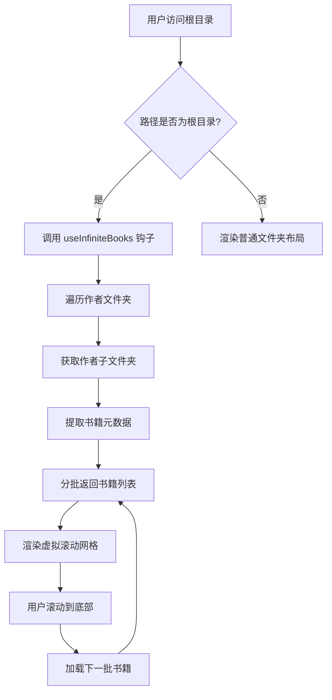

# Calibre-Web 风格主页实现计划

## 目标

修改 `src/components/FileListing.tsx`，在根目录（/）下显示类似 calibre-web 的书籍网格，替换现有的文件列表。支持虚拟滚动以分批加载超过 2000 本书籍。

## 数据结构

- OneDrive 根目录（/library）包含作者文件夹。
- 每个作者文件夹包含书名文件夹。
- 每个书名文件夹包含：
  - `cover.jpg`（封面图片）
  - `metadata.opf`（Calibre 元数据）
  - 电子书文件（.epub、.pdf、.cbz）

## 功能需求

1. 平铺显示所有书籍（忽略作者文件夹层级）
2. 每本书显示封面、书名、作者
3. 点击书籍卡片后预览对应的电子书（使用现有预览组件）
4. 虚拟滚动：分批加载书籍，滚动到底部时自动加载更多
5. 保持现有错误处理和加载状态

## 技术方案

### 1. 书籍数据获取（分批递归）

由于书籍数量超过 2000 本，我们需要一种高效的分批递归方法。我们将使用现有的 `traverseFolder` 函数，但对其进行修改以支持分页和限制。

#### 新增 API 端点（可选）

我们可以创建一个新的 API 端点 `/api/books`，它接受 `page` 和 `limit` 参数，返回分页的书籍列表。这需要修改后端，但能提供最佳性能。

**备选方案**：在客户端使用 `traverseFolder` 并配合生成器实现懒加载。我们将采用此方案以最小化后端修改。

#### 客户端懒加载

- 创建一个自定义钩子 `useInfiniteBooks`，它使用 `traverseFolder` 异步生成书籍元数据。
- 该钩子将返回一个书籍数组、一个加载更多书籍的函数、以及加载状态。
- 使用 `useState` 和 `useEffect` 管理内部状态，通过生成器逐步获取书籍。
- 每批加载 100 本书籍，当用户滚动到底部时触发加载下一批。

### 2. 书籍元数据提取

对于每个书名文件夹，我们将：

1. 通过 `/api/raw?path=.../cover.jpg` 获取封面图片 URL。
2. 通过 `/api/raw?path=.../metadata.opf` 获取 OPF 文件，并使用 `fetchOPFMetadata` 解析。
3. 如果 OPF 不存在，则使用文件夹名称作为书名，并从文件夹路径中推断作者。
4. 查找电子书文件（.epub、.pdf、.cbz）以生成预览链接。

### 3. 虚拟滚动网格组件

我们将使用 `react-window` 或 `react-virtualized` 实现虚拟滚动。由于项目尚未包含这些库，我们需要安装 `react-window` 和 `react-window-infinite-loader`。

#### 组件设计

- `BookGridVirtualized`：一个虚拟滚动网格，使用 `FixedSizeGrid` 或 `VariableSizeGrid`。
- 每项渲染一个 `BookCard` 组件。
- 集成 `InfiniteLoader` 以在滚动时加载更多书籍。

#### 备选方案：简单无限滚动

如果虚拟滚动太复杂，我们可以实现一个简单的无限滚动：当用户滚动到容器底部时，加载下一批书籍并追加到网格中。这可以使用 `IntersectionObserver` 或监听滚动事件实现。

### 4. 修改 FileListing.tsx

- 检测当前路径是否为根目录（`path === '/'`）。
- 如果是根目录，则渲染 `BookGridVirtualized` 而不是 `FolderGridLayout` 或 `FolderListLayout`。
- 将 `useInfiniteBooks` 钩子与 `BookGridVirtualized` 连接。
- 保留现有的加载和错误状态显示。

### 5. 预览集成

- 书籍卡片的 `bookUrl` 指向电子书文件路径（例如 `/library/作者/书名/书名.epub`）。
- 点击卡片时，用户将被导航到该路径，由现有的 `FileListing` 预览组件自动处理（EPUBPreview、PDFPreview、Linkcccp_CBZPreview）。
- 无需额外修改。

## 组件设计

### BookMetadata 类型

```typescript
interface BookMetadata {
  id: string // 文件夹 ID 或路径
  title: string
  authors: string[]
  coverUrl: string
  bookUrl: string // 电子书文件的原始 URL
  format: 'epub' | 'pdf' | 'cbz' | 'other'
  folderPath: string
}
```

### useInfiniteBooks 钩子

```typescript
function useInfiniteBooks(basePath: string) {
  const [books, setBooks] = useState<BookMetadata[]>([])
  const [loading, setLoading] = useState(false)
  const [hasMore, setHasMore] = useState(true)
  const [page, setPage] = useState(0)

  const loadMore = useCallback(async () => {
    if (loading || !hasMore) return
    setLoading(true)
    // 调用生成器获取下一批书籍
    // 更新 books 状态
    setLoading(false)
  }, [loading, hasMore])

  return { books, loading, hasMore, loadMore }
}
```

### BookCard 组件

- 显示封面图片（错误时显示占位符）
- 显示书名和作者
- 应用现有 Fluent UI 卡片样式

### BookGridVirtualized 组件

- 使用 `react-window` 的 `FixedSizeGrid`，每个单元格固定尺寸。
- 通过 `InfiniteLoader` 包装，提供 `isItemLoaded`、`loadMoreItems` 等属性。

## 实施步骤

### 第一阶段：基础书籍网格（无虚拟滚动）

1. 创建 `BookCard` 组件。
2. 创建 `useAllBooks` 钩子，递归获取所有书籍（仅用于测试）。
3. 修改 `FileListing.tsx` 以在根目录显示书籍网格。
4. 测试基本功能。

### 第二阶段：虚拟滚动

1. 安装 `react-window` 和 `react-window-infinite-loader`。
2. 创建 `BookGridVirtualized` 组件。
3. 实现 `useInfiniteBooks` 钩子，支持分批加载。
4. 集成虚拟滚动网格。
5. 测试性能和滚动行为。

### 第三阶段：优化和错误处理

1. 添加封面加载失败时的占位符。
2. 优化元数据缓存（使用 IndexedDB）。
3. 添加加载指示器和空状态。
4. 测试大规模书籍下的性能。

## 潜在问题

- 递归遍历文件夹可能导致 API 请求过多（需限制并发数）。
- 虚拟滚动需要预估项目尺寸，书籍卡片高度可能不同。
- 元数据提取失败时的降级处理。
- 作者文件夹数量过多时的初始加载延迟。

## 性能优化建议

- 使用 IndexedDB 缓存书籍元数据和封面图片 URL。
- 预加载下一批书籍。
- 使用 Web Workers 在后台解析 OPF 文件。

## 下一步

1. 创建详细组件设计图（Mermaid）
2. 切换到代码模式开始实施第一阶段。
3. 逐步完成各阶段任务。

## Mermaid 流程图



## 待办事项清单

- [ ] 创建 BookCard 组件
- [ ] 创建 useAllBooks 钩子（递归获取）
- [ ] 修改 FileListing.tsx 集成书籍网格
- [ ] 安装 react-window 和 react-window-infinite-loader
- [ ] 创建 BookGridVirtualized 组件
- [ ] 实现 useInfiniteBooks 钩子（分批加载）
- [ ] 集成虚拟滚动
- [ ] 添加错误处理和加载状态
- [ ] 测试性能
- [ ] 部署验证
