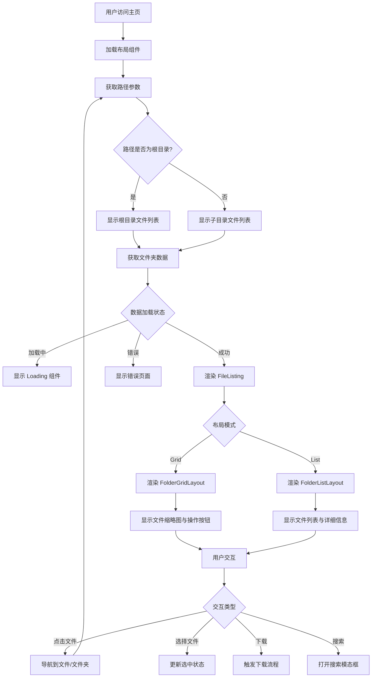

# 网站主页分析报告

## 项目概述

本项目是一个基于 Next.js 的 OneDrive 文件索引应用 (`onedrive-cf-index-ng`)，允许用户浏览、搜索、预览和下载存储在 OneDrive 中的文件。主页是应用的主要文件浏览界面。

## 技术栈

- **前端框架**: Next.js 13 (React 18)
- **样式**: Tailwind CSS + 自定义 Fluent Design 主题
- **图标**: Font Awesome
- **状态管理**: React Hooks (useState, useEffect), SWR 用于数据获取
- **路由**: Next.js 动态路由 (`[...path].tsx`)
- **构建工具**: pnpm

## 组件层次结构

```
HomePage (src/pages/index.tsx)
├── Head (Next.js 头部)
├── Navbar (src/components/Navbar.tsx)
│   ├── 图标 + 标题
│   ├── 搜索框 (触发 SearchModal)
│   ├── 社交链接 (GitHub 等)
│   ├── 邮箱链接
│   ├── 登出按钮 (若存在令牌)
│   └── 索引生成按钮 (Linkcccp 功能)
├── 主内容区
│   ├── 导航栏 (面包屑 + 布局切换)
│   │   ├── Breadcrumb (src/components/Breadcrumb.tsx)
│   │   └── SwitchLayout (src/components/SwitchLayout.tsx)
│   └── FileListing (src/components/FileListing.tsx)
│       ├── FolderGridLayout (网格布局)
│       ├── FolderListLayout (列表布局)
│       ├── 文件预览组件 (图片、视频、PDF 等)
│       └── 分页加载更多
└── Footer (src/components/Footer.tsx)
```

## 视觉设计分析

### 设计语言

- **主题**: Microsoft Fluent Design 系统
- **颜色系统**: 定义完整的浅色/深色主题变量
  - 主色调: `#0078D4` (浅色) / `#50E6FF` (深色)
  - 表面颜色: surface, surface-card, surface-panel
  - 文本颜色: primary, secondary, tertiary
- **圆角**: 使用 Fluent 标准 (`fluent-sm`, `fluent-md`, `fluent-lg`, `fluent-xl`)
- **阴影**: 多层阴影系统 (`fluent-sm` 至 `fluent-xl`)
- **动画**: 流畅的进入/退出动画 (`animate-fluent-enter`)

### 布局特点

1. **响应式设计**: 使用 Tailwind 响应式工具类
2. **粘性导航栏**: 顶部固定，亚克力毛玻璃效果
3. **卡片式设计**: 文件/文件夹以卡片形式呈现，带有阴影和边框
4. **双布局模式**: 网格布局 (缩略图展示) 和列表布局 (详细信息展示)

### 样式亮点

- 自定义滚动条样式
- 选择文本高亮
- 焦点轮廓样式
- 亚克力材质效果 (`fluent-acrylic`)
- 按钮变体 (`fluent-btn`, `fluent-btn-secondary`, `fluent-btn-accent`)

## 交互功能分析

### 1. 文件浏览与导航

- **面包屑导航**: 显示当前路径，支持快速跳转到上级目录
- **布局切换**: 网格/列表视图切换，偏好存储在 localStorage
- **分页加载**: 滚动加载更多文件 (OneDrive API 分页)

### 2. 文件操作

- **选择文件**: 复选框选择多个文件，支持全选/取消全选
- **批量下载**: 下载选中的多个文件 (ZIP 打包)
- **文件夹递归下载**: 下载整个文件夹及其子内容
- **复制永久链接**: 复制文件/文件夹的直接链接
- **文件预览**: 根据文件类型提供内嵌预览 (图片、视频、PDF、Markdown、代码等)

### 3. 搜索功能

- 快捷键 `Ctrl+K` / `Cmd+K` 打开搜索模态框
- 全局文件搜索 (基于 Pagefind 搜索索引)

### 4. 身份验证与安全

- **受保护路由**: 特定文件夹需要密码访问
- **令牌管理**: 存储在 localStorage，可手动清除
- **索引生成**: 需要管理员密钥重新生成文件索引

### 5. 用户体验增强

- **加载状态**: 文件加载时的骨架屏/旋转图标
- **错误处理**: 401/403/404 错误页面
- **深色模式**: 通过 CSS 类切换
- **快捷键支持**: 搜索快捷键
- **通知系统**: 使用 react-hot-toast 提示操作结果

## 架构图 (Mermaid)



## 数据流

1. **路径解析**: 通过 `queryToPath` 将 URL 查询参数转换为路径字符串
2. **数据获取**: 使用 `useProtectedSWRInfinite` 获取 OneDrive API 数据
3. **状态管理**: 选中状态、布局偏好、令牌状态使用 React 状态和 localStorage
4. **预览类型检测**: 根据文件扩展名决定使用哪个预览组件

## 改进建议

### 1. 性能优化

- **图片懒加载**: 网格布局中的缩略图实现懒加载
- **虚拟滚动**: 列表布局中大量文件时使用虚拟滚动
- **预加载**: 预加载父目录的常用文件

### 2. 用户体验

- **拖放操作**: 支持拖放文件进行选择
- **键盘导航**: 使用方向键浏览文件列表
- **多选模式**: Shift+点击连续选择，Ctrl+点击多选
- **面包屑下拉菜单**: 长路径时显示下拉菜单

### 3. 功能增强

- **文件上传**: 允许上传文件到当前目录
- **文件重命名/删除**: 基本文件操作
- **收藏夹**: 常用文件夹/文件的快速访问
- **分享链接**: 生成可分享的公开链接

### 4. 可访问性

- **ARIA 标签**: 为交互元素添加适当的 ARIA 属性
- **键盘导航**: 确保所有功能可通过键盘访问
- **屏幕阅读器支持**: 优化文件列表的语义化标记

### 5. 代码质量

- **类型安全**: 完善 TypeScript 类型定义 (当前某些组件使用 `any`)
- **组件拆分**: 将大型组件拆分为更小的可复用组件
- **错误边界**: 添加 React 错误边界防止整个应用崩溃

## 总结

网站主页采用现代化的 Fluent Design 设计语言，提供了直观的文件浏览体验。组件结构清晰，功能完整，涵盖了文件管理的主要需求。通过响应式设计和深色模式支持，确保了在不同设备和环境下的良好体验。建议的改进方向主要集中在性能优化、用户体验增强和可访问性提升。

---

_分析时间: 2026-01-20_
_分析版本: onedrive-cf-index-ng (基于代码分析)_
